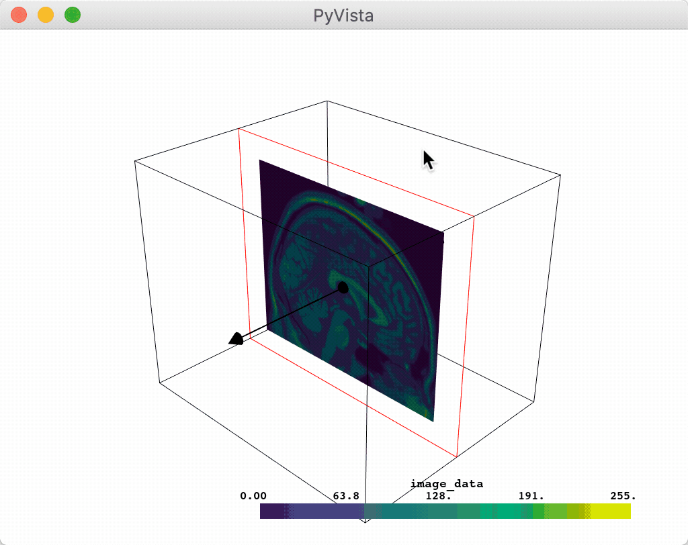

.. DO NOT EDIT.
.. THIS FILE WAS AUTOMATICALLY GENERATED BY SPHINX-GALLERY.
.. TO MAKE CHANGES, EDIT THE SOURCE PYTHON FILE:
.. "examples/03-widgets/plane-widget.py"
.. LINE NUMBERS ARE GIVEN BELOW.

.. only:: html

    .. note::
        :class: sphx-glr-download-link-note

        Click :ref:`here <sphx_glr_download_examples_03-widgets_plane-widget.py>`
        to download the full example code

.. rst-class:: sphx-glr-example-title

.. _sphx_glr_examples_03-widgets_plane-widget.py:

Plane Widget
~~~~~~~~~~~~

The plane widget can be enabled and disabled by the
:func:`pyvista.WidgetHelper.add_plane_widget` and
:func:`pyvista.WidgetHelper.clear_plane_widgets` methods respectively.
As with all widgets, you must provide a custom callback method to utilize that
plane. Considering that planes are most commonly used for clipping and slicing
meshes, we have included two helper methods for doing those tasks!

Let's use a plane to clip a mesh:

.. GENERATED FROM PYTHON SOURCE LINES 14-24

.. code-block:: default

    # sphinx_gallery_thumbnail_number = 2
    import pyvista as pv
    from pyvista import examples

    vol = examples.download_brain()

    p = pv.Plotter()
    p.add_mesh_clip_plane(vol)
    p.show()

.. image:: /examples/03-widgets/images/sphx_glr_plane-widget_001.png
    :alt: plane widget
    :class: sphx-glr-single-img

.. rst-class:: sphx-glr-script-out

 Out:

 .. code-block:: none

    [(578.7093647107201, 596.7093628033715, 578.7093628033715),
     (90.00000190734863, 108.0, 90.0),
     (0.0, 0.0, 1.0)]

.. GENERATED FROM PYTHON SOURCE LINES 25-26

After interacting with the scene, the clipped mesh is available as:

.. GENERATED FROM PYTHON SOURCE LINES 26-28

.. code-block:: default

    p.plane_clipped_meshes

.. rst-class:: sphx-glr-script-out

 Out:

 .. code-block:: none

    [UnstructuredGrid (0x7f18d387c050)
      N Cells:	3538080
      N Points:	3613484
      X Bounds:	9.000e+01, 1.800e+02
      Y Bounds:	0.000e+00, 2.160e+02
      Z Bounds:	0.000e+00, 1.800e+02
      N Arrays:	1
    ]

.. GENERATED FROM PYTHON SOURCE LINES 29-32

And here is a screen capture of a user interacting with this

.. image:: ../../images/gifs/plane-clip.gif

.. GENERATED FROM PYTHON SOURCE LINES 34-35

Or you could slice a mesh using the plane widget:

.. GENERATED FROM PYTHON SOURCE LINES 35-39

.. code-block:: default

    p = pv.Plotter()
    p.add_mesh_slice(vol)
    p.show()

.. image:: /examples/03-widgets/images/sphx_glr_plane-widget_002.png
    :alt: plane widget
    :class: sphx-glr-single-img

.. rst-class:: sphx-glr-script-out

 Out:

 .. code-block:: none

    [(578.7093647107201, 596.7093628033715, 578.7093628033715),
     (90.00000190734863, 108.0, 90.0),
     (0.0, 0.0, 1.0)]

.. GENERATED FROM PYTHON SOURCE LINES 40-41

After interacting with the scene, the slice is available as:

.. GENERATED FROM PYTHON SOURCE LINES 41-43

.. code-block:: default

    p.plane_sliced_meshes

.. rst-class:: sphx-glr-script-out

 Out:

 .. code-block:: none

    [PolyData (0x7f18d387cbb0)
      N Cells:	38880
      N Points:	39277
      X Bounds:	9.000e+01, 9.000e+01
      Y Bounds:	0.000e+00, 2.160e+02
      Z Bounds:	0.000e+00, 1.800e+02
      N Arrays:	1
    ]

.. GENERATED FROM PYTHON SOURCE LINES 44-47

And here is a screen capture of a user interacting with this

.. GENERATED FROM PYTHON SOURCE LINES 49-53

Or you could leverage the plane widget for some custom task like glyphing a
vector field along that plane. Note that we have to pass a ``name`` when
calling ``add_mesh`` to ensure that there is only one set of glyphs plotted
at a time.

.. GENERATED FROM PYTHON SOURCE LINES 53-72

.. code-block:: default

    import pyvista as pv
    from pyvista import examples

    mesh = examples.download_carotid()

    p = pv.Plotter()
    p.add_mesh(mesh.contour(8).extract_largest(), opacity=0.5)

    def my_plane_func(normal, origin):
        slc = mesh.slice(normal=normal, origin=origin)
        arrows = slc.glyph(orient='vectors', scale="scalars", factor=0.01)
        p.add_mesh(arrows, name='arrows')

    p.add_plane_widget(my_plane_func)
    p.show_grid()
    p.add_axes()
    p.show()

.. image:: /examples/03-widgets/images/sphx_glr_plane-widget_003.png
    :alt: plane widget
    :class: sphx-glr-single-img

.. rst-class:: sphx-glr-script-out

 Out:

 .. code-block:: none

    [(275.9751053451392, 242.47510534513918, 161.47510534513918),
     (137.5, 104.0, 23.0),
     (0.0, 0.0, 1.0)]

.. GENERATED FROM PYTHON SOURCE LINES 73-76

And here is a screen capture of a user interacting with this

.. image:: ../../images/gifs/plane-glyph.gif

.. GENERATED FROM PYTHON SOURCE LINES 79-83

Further, a user can disable the arrow vector by setting the
``normal_rotation`` argument to ``False``. For example, here we
programmatically set the normal vector on which we want to translate the
plane and we disable the arrow to prevent its rotation.

.. GENERATED FROM PYTHON SOURCE LINES 83-88

.. code-block:: default

    p = pv.Plotter()
    p.add_mesh_slice(vol, normal=(1,1,1), normal_rotation=False)
    p.show()

.. image:: /examples/03-widgets/images/sphx_glr_plane-widget_004.png
    :alt: plane widget
    :class: sphx-glr-single-img

.. rst-class:: sphx-glr-script-out

 Out:

 .. code-block:: none

    [(555.4519839675984, 573.4519839675984, 555.4519839675984),
     (90.0, 108.0, 90.0),
     (0.0, 0.0, 1.0)]

.. GENERATED FROM PYTHON SOURCE LINES 89-91

The vector is also forcibly disabled anytime the ``assign_to_axis`` argument
is set.

.. GENERATED FROM PYTHON SOURCE LINES 91-94

.. code-block:: default

    p = pv.Plotter()
    p.add_mesh_slice(vol, assign_to_axis='z')
    p.show()

.. image:: /examples/03-widgets/images/sphx_glr_plane-widget_005.png
    :alt: plane widget
    :class: sphx-glr-single-img

.. rst-class:: sphx-glr-script-out

 Out:

 .. code-block:: none

    [(578.7093628033715, 596.7093628033715, 578.7093647107201),
     (90.0, 108.0, 90.00000190734863),
     (0.0, 0.0, 1.0)]

.. rst-class:: sphx-glr-timing

   **Total running time of the script:** ( 0 minutes  8.548 seconds)

.. _sphx_glr_download_examples_03-widgets_plane-widget.py:

.. only :: html

 .. container:: sphx-glr-footer
    :class: sphx-glr-footer-example

  .. container:: sphx-glr-download sphx-glr-download-python

     :download:`Download Python source code: plane-widget.py <plane-widget.py>`

  .. container:: sphx-glr-download sphx-glr-download-jupyter

     :download:`Download Jupyter notebook: plane-widget.ipynb <plane-widget.ipynb>`

.. only:: html

 .. rst-class:: sphx-glr-signature

    `Gallery generated by Sphinx-Gallery <https://sphinx-gallery.github.io>`_
