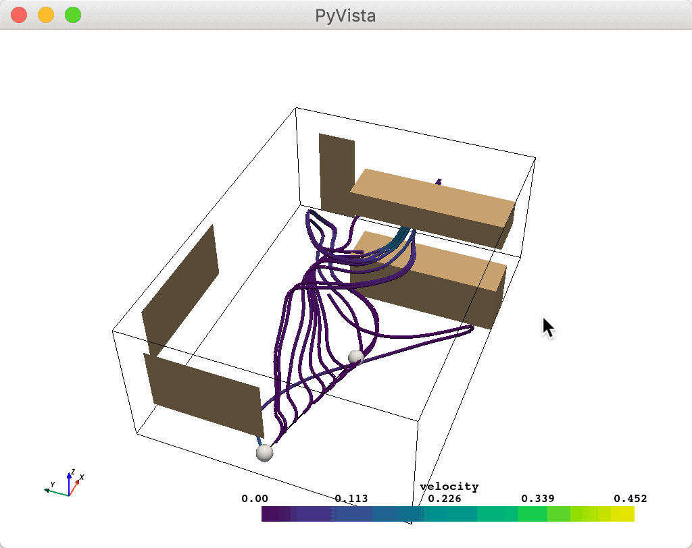

.. DO NOT EDIT.
.. THIS FILE WAS AUTOMATICALLY GENERATED BY SPHINX-GALLERY.
.. TO MAKE CHANGES, EDIT THE SOURCE PYTHON FILE:
.. "examples/03-widgets/line-widget.py"
.. LINE NUMBERS ARE GIVEN BELOW.

.. only:: html

    .. note::
        :class: sphx-glr-download-link-note

        Click :ref:`here <sphx_glr_download_examples_03-widgets_line-widget.py>`
        to download the full example code

.. rst-class:: sphx-glr-example-title

.. _sphx_glr_examples_03-widgets_line-widget.py:

.. _line_widget_example:

Line Widget
~~~~~~~~~~~

The line widget can be enabled and disabled by the
:func:`pyvista.Plotter.add_line_widget` and
:func:`pyvista.Plotter.clear_line_widgets` methods respectively.
Unfortunately, PyVista does not have any helper methods to utilize this
widget, so it is necessary to pass a custom callback method.

One particularly fun example is to use the line widget to create a source for
the :func:`pyvista.DataSetFilters.streamlines` filter. Again note the use of
the ``name`` argument in ``add_mesh``.

.. GENERATED FROM PYTHON SOURCE LINES 17-31

.. code-block:: default

    import numpy as np

    import pyvista as pv
    from pyvista import examples

    pv.set_plot_theme('document')

    mesh = examples.download_kitchen()
    furniture = examples.download_kitchen(split=True)

    arr = np.linalg.norm(mesh['velocity'], axis=1)
    clim = [arr.min(), arr.max()]

.. GENERATED FROM PYTHON SOURCE LINES 32-49

.. code-block:: default

    p = pv.Plotter()
    p.add_mesh(furniture, name='furniture', color=True)
    p.add_mesh(mesh.outline(), color='black')
    p.add_axes()

    def simulate(pointa, pointb):
        streamlines = mesh.streamlines(
            n_points=10, max_steps=100, pointa=pointa, pointb=pointb, integration_direction='forward'
        )
        p.add_mesh(streamlines, name='streamlines', line_width=5, render_lines_as_tubes=True, clim=clim)

    p.add_line_widget(callback=simulate, use_vertices=True)
    p.show()

.. image-sg:: /examples/03-widgets/images/sphx_glr_line-widget_001.png
   :alt: line widget
   :srcset: /examples/03-widgets/images/sphx_glr_line-widget_001.png
   :class: sphx-glr-single-img

.. GENERATED FROM PYTHON SOURCE LINES 50-53

And here is a screen capture of a user interacting with this

.. rst-class:: sphx-glr-timing

   **Total running time of the script:** ( 0 minutes  1.797 seconds)

.. _sphx_glr_download_examples_03-widgets_line-widget.py:

.. only :: html

 .. container:: sphx-glr-footer
    :class: sphx-glr-footer-example

  .. container:: sphx-glr-download sphx-glr-download-python

     :download:`Download Python source code: line-widget.py <line-widget.py>`

  .. container:: sphx-glr-download sphx-glr-download-jupyter

     :download:`Download Jupyter notebook: line-widget.ipynb <line-widget.ipynb>`

.. only:: html

 .. rst-class:: sphx-glr-signature

    `Gallery generated by Sphinx-Gallery <https://sphinx-gallery.github.io>`_
